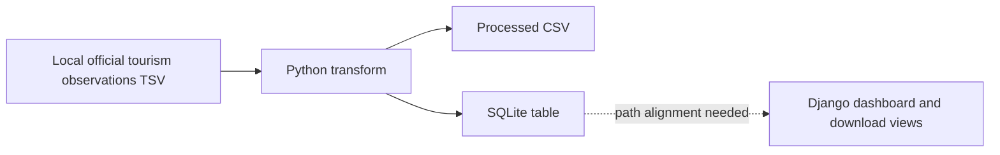

# Canary Islands Tourism Analytics

**Public exploratory project · Python / SQLite / Django · Not production-ready**

A hands-on data product experiment built around official tourism data. The repository contains data acquisition and transformation scripts, a SQLite-backed analytical dataset, and a Django application with dashboard and CSV-download routes.

This project demonstrates how I approach an analytical question from source-data handling through to a decision-oriented interface. It is a **learning/prototype repository**, not a maintained public data service.

## The question

How can open tourism observations be prepared for consistent time-series analysis by period and place of residence—and exposed through a small web interface?

## What the code currently contains

| Area | Evidence in repository | Status |
| --- | --- | --- |
| Data preparation | `etl/frontur_canarias_etl.py` reads an ISTAC observations TSV, filters and normalizes monthly Canary Islands tourist observations | Implemented as script; requires a local source file |
| Persistence | ETL writes a processed CSV and SQLite table `frontur_canarias_monthly` | Implemented; local paths require alignment with Django |
| Web interface | Django `analytics/views.py` builds aggregates, comparative periods, filters and downloadable data | Application code exists; end-to-end run not verified |
| Additional ingestion | Other ETL/download scripts under `etl/` | Exploratory; not verified as a fully automated pipeline |
| Quality checks | `test_sqlite_frontur.py` and Django test module | Insufficient to claim reliable automated coverage |

No reproducible dashboard build, production environment, CI quality gate, automated scheduled ingestion or published Power BI report is claimed here.

## Architecture at a glance

The dotted edge is intentional: the current repository does **not** guarantee the ETL's output database is the same file the Django application reads.

## Repository map

- `etl/` — scripts for tourism data retrieval/preparation.
- `django_app/` — Django project, analytics views, templates and routes.
- `db.sqlite3` — repository-root database snapshot; provenance and freshness are not independently verified here.
- `requirements.txt` — Python dependencies.
- `test_sqlite_frontur.py` — diagnostic script; see limitations below.

## Reproducing parts of the analysis

Prerequisites: compatible Python environment and access to the relevant official source data.

1. Create a virtual environment and install root dependencies with `pip install -r requirements.txt`.
2. Supply the expected ISTAC observations file locally at `data/raw/dataset-ISTAC-E16028B_000001-~latest-observations.tsv` (not included in this repository).
3. Run `python etl/frontur_canarias_etl.py` from the repository root.
4. Inspect the generated `data/processed/frontur_canarias_monthly.csv` and SQLite output.

**Django caveat:** the ETL currently writes to `db.sqlite3` in the repository root; Django's settings reference a different `db.sqlite3` under `django_app/`. Resolve that path mismatch and confirm database table compatibility before expecting `python manage.py runserver` to work against the newly generated dataset.

## Known limitations / technical debt

- Source data is not committed as a reproducible fixture, so a clean clone cannot run the ETL unassisted.
- ETL uses a local data file and is not an automatic scheduled pipeline.
- The Django database path differs from the ETL output path.
- `test_sqlite_frontur.py` is a diagnostic script referencing `frontur_euskadi_2021`, not a proper regression test for the current `frontur_canarias_monthly` pipeline.
- Tests, data contracts, source freshness checks and deployment readiness have not been established.
- The repository's existing database file should not be interpreted as a continuously refreshed official dataset.

## Sensible next steps

Align database paths; add a small open-licensed test fixture; separate source acquisition from transformation; add schema checks and runnable regression tests; document data provenance and update cadence.

## Data provenance

The code refers to **ISTAC / FRONTUR** tourism observations. Verify the current official source, licence and definitions before using results externally. This is an independent portfolio exercise and is not affiliated with the data publisher.
